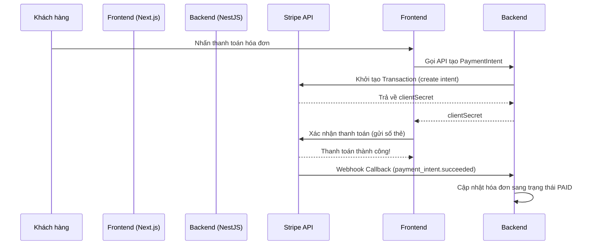

# 📚 TÀI LIỆU HỆ THỐNG HỢP NHẤT (CONSOLIDATED WORKSPACE DOCUMENTATION)
## Dự án: Hệ thống Quản lý Thuê Xe (Car Rental System)

> [!NOTE]  
> Tài liệu này được tổng hợp từ tất cả các tệp `.md` riêng lẻ trong thư mục gốc của dự án nhằm tạo ra một nguồn tài liệu tham khảo duy nhất, nhất quán và dễ tìm kiếm cho cả Frontend (Next.js) và Backend (NestJS + Prisma + MongoDB).

---

## 🗺️ MỤC LỤC CHÍNH
1. [⚡ Hướng Dẫn Khởi Động Nhanh (Quickstart)](#1-hướng-dẫn-khởi-động-nhanh-quickstart)
2. [🛠️ Chi Tiết Công Nghệ (Tech Stack)](#2-chi-tiết-công-nghệ-tech-stack)
3. [🗄️ Thiết Kế Cơ Sở Dữ Liệu & Hướng Dẫn Prisma MongoDB](#3-thiết-kế-cơ-sở-dữ-liệu--hướng-dẫn-prisma-mongodb)
4. [📊 Tình Trạng Tính Năng & Checklist 37 Bảng](#4-tình-trạng-tính-năng--checklist-37-bảng)
5. [🔴 Hướng Dẫn Triển Khai Chức Năng Ưu Tiên Cao (Rate Limiting, VNPay, ViewCount, Redirects)](#5-hướng-dẫn-triển-khai-chức-năng-ưu-tiên-cao-rate-limiting-vnpay-viewcount-redirects)
6. [💳 Cấu Hình Thanh Toán Stripe & Tiền Mặt](#6-cấu-hình-thanh-toán-stripe--tiền-mặt)
7. [📊 Xuất Báo Cáo Excel/PDF (Export Reports)](#7-xuất-báo-cáo-excelpdf-export-reports)
8. [📋 Báo Cáo Validation Các Form & Giải Pháp](#8-báo-cáo-validation-các-form--giải-pháp)
9. [🧪 Cấu Hình Kiểm Thử (Testing Setup Guide)](#9-cấu-hình-kiểm-thử-testing-setup-guide)
10. [📦 Hướng Dẫn Tạo Các Module Mới Trực Quan](#10-hướng-dẫn-tạo-các-module-mới-trực-quan)

---

## 1. ⚡ Hướng Dẫn Khởi Động Nhanh (Quickstart)

### 🎯 Mục Tiêu
Sau 10 phút, bạn sẽ khởi chạy thành công:
* Backend NestJS kết nối MongoDB + Redis.
* Frontend Next.js với giao diện Tailwind.
* Chạy thử và tạo API đầu tiên.

### Bước 1: Cài đặt công cụ
* **Windows (PowerShell):** Tải và cài đặt Node.js 18+, MongoDB Community Edition 7+, Redis (hoặc dùng Docker).
* Cài đặt NestJS CLI trên môi trường global: `npm i -g @nestjs/cli`

### Bước 2: Chạy dự án Workspace Monorepo
Dự án được cấu hình bằng `pnpm`. Để chạy đồng thời cả Backend và Frontend:
1. Chạy lệnh cài đặt thư viện tại root:
   ```powershell
   pnpm install
   ```
2. Khởi chạy Backend và Frontend ở hai cửa sổ terminal:
   * **Chạy Backend:** `pnpm dev:backend` (chạy tại cổng 3001 mặc định theo cấu hình `.env`)
   * **Chạy Frontend:** `pnpm dev:frontend` (chạy tại cổng 3000)

---

## 2. 🛠️ Chi Tiết Công Nghệ (Tech Stack)

```
Backend:   NestJS 10 + TypeScript + Prisma ORM
Frontend:  Next.js 14 + React 19 + TailwindCSS
Database:  MongoDB 7 + Redis 7
Cấu hình:  PNPM Workspace Monorepo
```

### 🔧 Backend Dependencies
* `@nestjs/core`, `@nestjs/common`, `@nestjs/platform-express`
* `@prisma/client`, `prisma` (ORM kết nối MongoDB)
* `@nestjs/jwt`, `@nestjs/passport`, `passport-jwt`, `bcryptjs`
* `class-validator`, `class-transformer` (Validate DTOs)
* `@nestjs/throttler` (Rate Limiter bảo vệ API)
* `socket.io` (Realtime Notification)

### 🎨 Frontend Dependencies
* `next` (v16.0.10), `react` (19.2.0), `react-dom` (19.2.0)
* `@tailwindcss/postcss`, `tailwindcss` (v4)
* `lucide-react` (Bộ icon chính)
* `@tanstack/react-query`, `axios`, `swr` (Data fetching & state)
* `framer-motion` (Hiệu ứng animation)
* `@stripe/stripe-js`, `@stripe/react-stripe-js` (Thanh toán online)
* `recharts` (Vẽ biểu đồ dashboard)

---

## 3. 🗄️ Thiết Kế Cơ Sở Dữ Liệu & Hướng Dẫn Prisma MongoDB

### ⚠️ Cơ chế làm việc của Prisma với MongoDB
Vì MongoDB là NoSQL Database, **Prisma không hỗ trợ cơ chế chạy migration tuần tự `prisma migrate dev`** như các hệ quản trị SQL (PostgreSQL, MySQL).

### Quy trình thay đổi Schema (Schema Updates):
1. **Sửa file schema**: Chỉnh sửa trực tiếp file [schema.prisma](file:///c:/source/rental-lv/backend/prisma/schema.prisma) để thêm field hoặc model mới.
2. **Tạo lại Prisma Client**: Chạy lệnh tại thư mục root hoặc backend:
   ```powershell
   pnpm prisma:generate
   ```
3. **Cập nhật dữ liệu cũ (Optional)**: Khi thêm các trường bắt buộc hoặc trường có giá trị mặc định cho documents cũ đã tồn tại, ta viết script cập nhật thủ công (sử dụng `updateMany`) để tránh lỗi thiếu trường dữ liệu trong database.

---

## 4. 📊 Tình Trạng Tính Năng & Checklist 37 Bảng

Hệ thống đã triển khai đầy đủ **37/37 bảng** nghiệp vụ chia thành 4 nhóm cốt lõi:

### 🔴 Core Business (20 bảng)
1. `VehicleCategory` (Phân loại xe)
2. `Vehicle` (Thông tin xe)
3. `VehicleDocument` (Giấy tờ xe đi kèm)
4. `Branch` (Chi nhánh cửa hàng)
5. `PriceList` (Danh sách bảng giá)
6. `Customer` (Hồ sơ khách hàng, tích hợp điểm tích lũy & Corporate fields)
7. `Employee` (Thông tin nhân viên)
8. `User` (Tài khoản bảo mật đăng nhập)
9. `Booking` (Yêu cầu đặt thuê xe)
10. `Contract` (Hợp đồng thuê xe)
11. `Deposit` (Khoản đặt cọc)
12. `DepositDetail` (Chi tiết tài sản thế chấp cọc)
13. `Handover` (Bản bàn giao giao xe)
14. `ReturnReport` (Bản nhận xe trả)
15. `Invoice` (Hóa đơn thanh toán)
16. `Payment` (Lịch sử thanh toán thực tế)
17. `Surcharge` (Khoản phụ phí phát sinh)
18. `Promotion` (Mã giảm giá chương trình khuyến mãi)
19. `Maintenance` (Nhật ký bảo dưỡng định kỳ)
20. `AuditLog` (Nhật ký thay đổi lịch sử hệ thống)

### 🟡 SEO & Content (5 bảng)
21. `BlogPost` (Bài viết chuẩn SEO)
22. `BlogCategory` (Danh mục blog)
23. `Page` (Các trang tĩnh: Về chúng tôi, FAQ, Điều khoản...)
24. `Review` (Đánh giá khách hàng phục vụ SEO Schema rich snippets)
25. `SeoRedirect` (Định tuyến 301/302 tự động)

### 🟢 Marketing & CRM (6 bảng)
26. `Notification` (Thông báo realtime)
27. `NotificationTemplate` (Mẫu thông báo Email/SMS/Push)
28. `CustomerSegment` (Phân khúc khách hàng theo chi tiêu)
29. `MarketingCampaign` (Chiến dịch gửi tin nhắn/email hàng loạt)
30. `LoyaltyProgram` (Quy định tích điểm hội viên)
31. `LoyaltyTransaction` (Nhật ký cộng/trừ điểm thưởng)

### 🟣 Enterprise Features (6 bảng)
32. `Tenant` (Cấu hình Multi-tenant SaaS)
33. `SubscriptionPlan` (Gói phí dịch vụ thuê phần mềm)
34. `PricingRule` (Định giá tăng/giảm giá động theo ngày lễ, cuối tuần)
35. `CorporateAccount` (Thông tin doanh nghiệp trực tiếp trong bảng Customer)
36. `Partner` (Quản lý đại lý/đối tác cộng tác viên)
37. `SystemConfig` (Tham số cài đặt cấu hình hệ thống)

---

## 5. 🔴 Hướng Dẫn Triển Khai Chức Năng Ưu Tiên Cao (Rate Limiting, VNPay, ViewCount, Redirects)

### 5.1 Rate Limiting (Bảo vệ API chống DDoS)
Sử dụng gói `@nestjs/throttler` trong NestJS để giới hạn số lượng request.
* **Cài đặt:** `pnpm --filter backend install @nestjs/throttler`
* **Đăng ký guard toàn cục trong `app.module.ts`**:
```typescript
import { ThrottlerModule, ThrottlerGuard } from '@nestjs/throttler';
import { APP_GUARD } from '@nestjs/core';

@Module({
  imports: [
    ThrottlerModule.forRoot([{
      ttl: 60000,  // 1 phút
      limit: 60,   // tối đa 60 requests/phút
    }]),
  ],
  providers: [
    {
      provide: APP_GUARD,
      useClass: ThrottlerGuard,
    },
  ],
})
export class AppModule {}
```

### 5.2 Tăng số lượt xem (ViewCount) của xe tự động
Khi khách hàng gọi API xem chi tiết xe thông qua ID hoặc Slug, thực hiện cập nhật bất đồng bộ lượt xem tăng thêm 1 (pattern fire-and-forget) nhằm giảm độ trễ cho client:
```typescript
// backend/src/modules/vehicle/vehicle.service.ts
async findOne(id: string, incrementView: boolean = true) {
  const vehicle = await this.prisma.vehicle.findUnique({ where: { id } });
  if (vehicle && incrementView) {
    this.prisma.vehicle.update({
      where: { id },
      data: { viewCount: { increment: 1 } },
    }).catch(console.error); // Không dùng await để tối ưu hóa thời gian phản hồi API
  }
  return vehicle;
}
```

### 5.3 Định giá xe động (PricingRule)
Khi tính toán tổng tiền đặt xe, BookingService sẽ kiểm tra quy tắc giá đặc thù được cấu hình trong bảng `PricingRule` (ưu tiên rule theo xe trước, sau đó tới rule theo danh mục xe):
```typescript
// backend/src/modules/booking/booking.service.ts
async calculateDynamicPrice(vehicleId: string, pickupDate: Date, returnDate: Date) {
  const vehicle = await this.prisma.vehicle.findUnique({
    where: { id: vehicleId },
    include: { category: true }
  });
  let dailyRate = vehicle.priceList?.dailyRate || 0;
  
  // Tìm quy tắc áp dụng
  const rule = await this.prisma.pricingRule.findFirst({
    where: {
      OR: [
        { vehicleId: vehicleId },
        { categoryId: vehicle.categoryId }
      ],
      startDate: { lte: pickupDate },
      endDate: { gte: returnDate }
    }
  });

  if (rule) {
    if (rule.percent) {
      dailyRate = dailyRate * (1 + rule.percent / 100);
    } else if (rule.amount) {
      dailyRate += rule.amount;
    }
  }
  return dailyRate;
}
```

---

## 6. 💳 Cấu HÌnh Thanh Toán Stripe & Tiền Mặt

Hệ thống hỗ trợ 2 hình thức thanh toán chính:
1. **Stripe**: Thanh toán trực tuyến bằng thẻ tín dụng quốc tế.
2. **Cash (Tiền mặt)**: Khách trả trực tiếp và nhân viên xác nhận hóa đơn.

### Cấu hình biến môi trường
* **Backend (.env):**
  ```env
  STRIPE_SECRET_KEY=sk_test_...
  STRIPE_WEBHOOK_SECRET=whsec_...
  ```
* **Frontend (.env.local):**
  ```env
  NEXT_PUBLIC_STRIPE_PUBLISHABLE_KEY=pk_test_...
  ```

### Quy trình thanh toán Stripe (Webhook Flow)


---

## 7. 📊 Xuất Báo Cáo Excel/PDF (Export Reports)

### Cài đặt thư viện hỗ trợ
* **Cài đặt Excel:** `pnpm --filter backend install xlsx`
* **Cài đặt PDF:** `pdfkit` (sẵn có trong NestJS backend để tạo văn bản Hợp đồng A4).

### Triển khai Controller xuất file Excel
```typescript
// backend/src/modules/reports/reports.controller.ts
import { Controller, Get, Res, UseGuards } from '@nestjs/common';
import { Response } from 'express';
import { ReportsService } from './reports.service';

@Controller('reports')
export class ReportsController {
  constructor(private reportsService: ReportsService) {}

  @Get('bookings/export')
  async exportBookings(@Res() res: Response) {
    const buffer = await this.reportsService.exportBookingsToExcel();
    res.setHeader('Content-Type', 'application/vnd.openxmlformats-officedocument.spreadsheetml.sheet');
    res.setHeader('Content-Disposition', 'attachment; filename=danh-sach-dat-xe.xlsx');
    res.send(buffer);
  }
}
```

---

## 8. 📋 Báo Cáo Validation Các Form & Giải Pháp

Hiện trạng các Form trong admin (nhập thông tin khách hàng, xe, khuyến mãi) chủ yếu dựa vào thuộc tính `required` của thẻ HTML5, dẫn đến trải nghiệm người dùng chưa tối ưu khi nhập sai định dạng.

### Quy chuẩn Regex Validation cần bổ sung:
* **Số điện thoại Việt Nam (10 số bắt đầu bằng 0):** `/^0\d{9}$/`
* **Định dạng Email:** `/^[^\s@]+@[^\s@]+\.[^\s@]+$/`
* **Biển số xe Việt Nam:** `/^[0-9]{2}[A-Z]{1,2}-[0-9]{4,5}$/` (Ví dụ: 30A-12345)
* **Số CMND/CCCD (9 hoặc 12 số):** `/^[0-9]{9}$|^[0-9]{12}$/`

### Đề xuất giải pháp Frontend:
Sử dụng **React Hook Form** kết hợp với **Zod Schema Validation** thay thế việc kiểm tra điều kiện thủ công:
```typescript
import { z } from 'zod';

export const customerSchema = z.object({
  fullName: z.string().min(2, "Họ tên phải từ 2 ký tự trở lên"),
  phone: z.string().regex(/^0\d{9}$/, "Số điện thoại không hợp lệ (cần 10 số bắt đầu bằng 0)"),
  email: z.string().email("Email sai định dạng").optional(),
});
```

---

## 9. 🧪 Cấu Hình Kiểm Thử (Testing Setup Guide)

### Cấu hình Jest cho Backend (Unit Test)
Tạo tệp cấu hình `jest.config.js` trong thư mục [backend/](file:///c:/source/rental-lv/backend/):
```javascript
module.exports = {
  moduleFileExtensions: ['js', 'json', 'ts'],
  rootDir: 'src',
  testRegex: '.*\\.spec\\.ts$',
  transform: {
    '^.+\\.(t|j)s$': 'ts-jest',
  },
  testEnvironment: 'node',
};
```

### Cấu hình Playwright cho Frontend (End-to-End E2E Test)
Tạo tệp cấu hình `playwright.config.ts` trong thư mục [frontends/](file:///c:/source/rental-lv/frontends/):
```typescript
import { defineConfig, devices } from '@playwright/test';

export default defineConfig({
  testDir: './e2e',
  use: {
    baseURL: 'http://localhost:3000',
    trace: 'on-first-retry',
  },
  projects: [
    {
      name: 'chromium',
      use: { ...devices['Desktop Chrome'] },
    },
  ],
});
```

---

## 10. 📦 Hướng Dẫn Tạo Các Module Mới Trực Quan

Mỗi khi hệ thống cần mở rộng thêm các bảng/model mới từ Prisma, hãy tuân thủ cấu trúc module khép kín sau:

### Cấu trúc thư mục chuẩn
```
backend/src/modules/{ten-module}/
├── {ten-module}.module.ts
├── {ten-module}.controller.ts
├── {ten-module}.service.ts
└── dto/
    ├── create-{ten-module}.dto.ts
    ├── update-{ten-module}.dto.ts
    └── {ten-module}-query.dto.ts
```

### Tệp cấu hình Module mẫu (`{ten-module}.module.ts`)
```typescript
import { Module } from '@nestjs/common';
import { NameController } from './{name}.controller';
import { NameService } from './{name}.service';
import { PrismaService } from '@/prisma/prisma.service';
import { AuditLogService } from '../audit-log/audit-log.service';

@Module({
  controllers: [NameController],
  providers: [NameService, PrismaService, AuditLogService],
  exports: [NameService]
})
export class NameModule {}
```

---
> **Tài liệu được cập nhật lần cuối ngày:** 13/06/2026.
