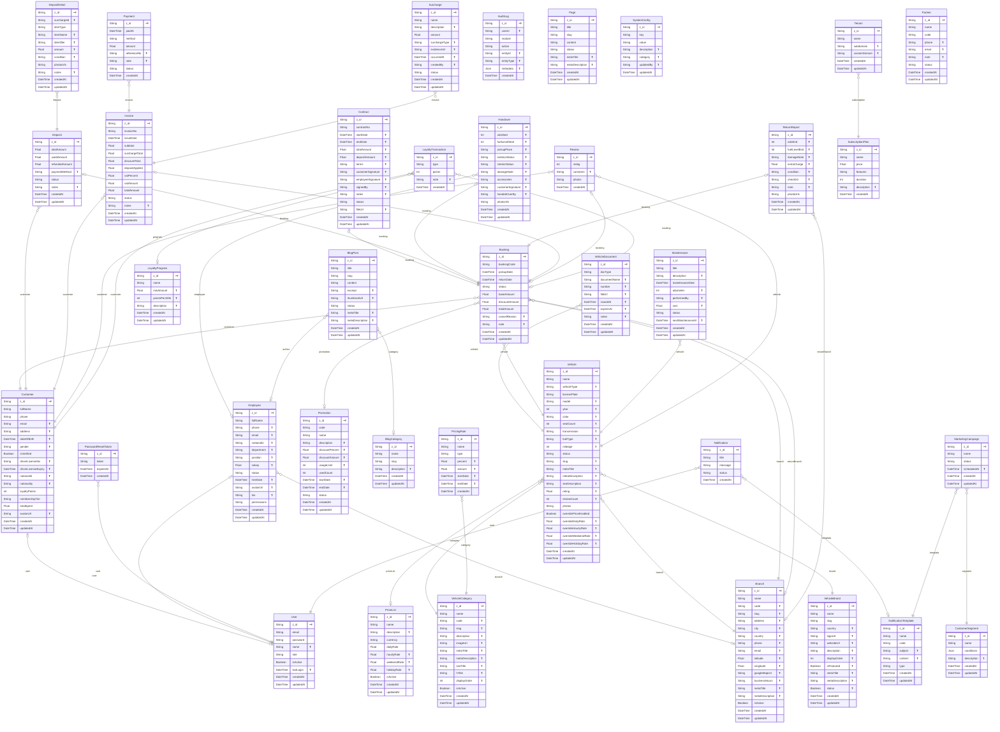

```mermaid
erDiagram

  "User" {
    String z_id "🗝️"
    String email 
    String password 
    String name "❓"
    String role 
    Boolean isActive 
    DateTime lastLogin "❓"
    DateTime createdAt 
    DateTime updatedAt 
    }
  

  "Customer" {
    String z_id "🗝️"
    String fullName 
    String phone 
    String email "❓"
    String address "❓"
    DateTime dateOfBirth "❓"
    String gender "❓"
    Boolean isVerified 
    String driverLicenseNo "❓"
    DateTime driverLicenseExpiry "❓"
    String nationalId "❓"
    String nationality "❓"
    Int loyaltyPoints 
    String membershipTier 
    Float totalSpent 
    String avatarUrl "❓"
    DateTime createdAt 
    DateTime updatedAt 
    }
  

  "Employee" {
    String z_id "🗝️"
    String fullName 
    String phone "❓"
    String email "❓"
    String nationalId "❓"
    String department "❓"
    String position "❓"
    Float salary "❓"
    String status 
    DateTime hireDate "❓"
    String avatarUrl "❓"
    String bio "❓"
    String permissions 
    DateTime createdAt 
    DateTime updatedAt 
    }
  

  "Branch" {
    String z_id "🗝️"
    String name 
    String code "❓"
    String slug "❓"
    String address "❓"
    String city "❓"
    String country "❓"
    String phone "❓"
    String email "❓"
    Float latitude "❓"
    Float longitude "❓"
    String googleMapUrl "❓"
    String businessHours "❓"
    String metaTitle "❓"
    String metaDescription "❓"
    Boolean isActive 
    DateTime createdAt 
    DateTime updatedAt 
    }
  

  "VehicleCategory" {
    String z_id "🗝️"
    String name 
    String code "❓"
    String slug "❓"
    String description "❓"
    String imageUrl "❓"
    String metaTitle "❓"
    String metaDescription "❓"
    String seoTitle "❓"
    String hTitle "❓"
    Int displayOrder "❓"
    Boolean isActive 
    DateTime createdAt 
    DateTime updatedAt 
    }
  

  "PriceList" {
    String z_id "🗝️"
    String name 
    String description "❓"
    String currency 
    Float dailyRate 
    Float hourlyRate "❓"
    Float weekendRate "❓"
    Float holidayRate "❓"
    Boolean isActive 
    DateTime createdAt 
    DateTime updatedAt 
    }
  

  "Vehicle" {
    String z_id "🗝️"
    String name 
    String vehicleType "❓"
    String licensePlate 
    String model "❓"
    Int year "❓"
    String color "❓"
    Int seatCount "❓"
    String transmission "❓"
    String fuelType "❓"
    Int mileage "❓"
    String status 
    String slug "❓"
    String metaTitle "❓"
    String metaDescription "❓"
    String seoDescription "❓"
    Float rating "❓"
    Int reviewCount "❓"
    String photos 
    Boolean overridePriceEnabled 
    Float overrideDailyRate "❓"
    Float overrideHourlyRate "❓"
    Float overrideWeekendRate "❓"
    Float overrideHolidayRate "❓"
    DateTime createdAt 
    DateTime updatedAt 
    }
  

  "VehicleBrand" {
    String z_id "🗝️"
    String name 
    String slug 
    String country "❓"
    String logoUrl "❓"
    String websiteUrl "❓"
    String description "❓"
    Int displayOrder "❓"
    Boolean isFeatured "❓"
    String metaTitle "❓"
    String metaDescription "❓"
    Boolean status "❓"
    DateTime createdAt 
    DateTime updatedAt 
    }
  

  "VehicleDocument" {
    String z_id "🗝️"
    String docType 
    String documentName "❓"
    String number "❓"
    String fileUrl "❓"
    DateTime issuedAt "❓"
    DateTime expiresAt "❓"
    String notes "❓"
    DateTime createdAt 
    DateTime updatedAt 
    }
  

  "Booking" {
    String z_id "🗝️"
    String bookingCode 
    DateTime pickupDate 
    DateTime returnDate 
    String status 
    Float baseAmount 
    Float discountAmount 
    Float totalAmount 
    String cancelReason "❓"
    String note "❓"
    DateTime createdAt 
    DateTime updatedAt 
    }
  

  "Contract" {
    String z_id "🗝️"
    String contractNo 
    DateTime startDate "❓"
    DateTime endDate "❓"
    Float totalAmount "❓"
    Float depositAmount "❓"
    String terms "❓"
    String customerSignature "❓"
    String employeeSignature "❓"
    String signedBy "❓"
    String notes "❓"
    String status 
    String fileUrl "❓"
    DateTime createdAt 
    DateTime updatedAt 
    }
  

  "Deposit" {
    String z_id "🗝️"
    Float totalAmount 
    Float usedAmount 
    Float refundedAmount 
    String paymentMethod "❓"
    String status 
    String notes "❓"
    DateTime createdAt 
    DateTime updatedAt 
    }
  

  "DepositDetail" {
    String z_id "🗝️"
    String surchargeId "❓"
    String itemType 
    String itemName "❓"
    String identifier "❓"
    Float amount "❓"
    String condition "❓"
    String photoUrls 
    String notes "❓"
    DateTime createdAt 
    DateTime updatedAt 
    }
  

  "Handover" {
    String z_id "🗝️"
    Int odoStart "❓"
    Int fuelLevelStart "❓"
    String pickupPlace "❓"
    String exteriorStatus "❓"
    String interiorStatus "❓"
    String damageNote "❓"
    String accessories "❓"
    String customerSignature "❓"
    String handedOverBy "❓"
    String photoUrls 
    DateTime createdAt 
    DateTime updatedAt 
    }
  

  "ReturnReport" {
    String z_id "🗝️"
    Int odoEnd "❓"
    Int fuelLevelEnd "❓"
    String damageNote "❓"
    Float extraCharge "❓"
    String condition "❓"
    String checklist "❓"
    String note "❓"
    String photoUrls 
    DateTime createdAt 
    DateTime updatedAt 
    }
  

  "Invoice" {
    String z_id "🗝️"
    String invoiceNo 
    DateTime issueDate 
    Float subtotal 
    Float surchargeTotal 
    Float discountTotal 
    Float depositApplied 
    Float vatPercent 
    Float vatAmount 
    Float totalAmount 
    String status 
    String notes "❓"
    DateTime createdAt 
    DateTime updatedAt 
    }
  

  "Payment" {
    String z_id "🗝️"
    DateTime paidAt 
    String method 
    Float amount 
    String referenceNo "❓"
    String note "❓"
    String status 
    DateTime createdAt 
    }
  

  "Surcharge" {
    String z_id "🗝️"
    String name 
    String description "❓"
    Float amount 
    String surchargeType "❓"
    String evidenceUrl "❓"
    DateTime occurredAt "❓"
    String createdBy "❓"
    String status 
    DateTime createdAt 
    DateTime updatedAt 
    }
  

  "Promotion" {
    String z_id "🗝️"
    String code 
    String name 
    String description "❓"
    Float discountPercent "❓"
    Float discountAmount "❓"
    Int usageLimit "❓"
    Int usedCount 
    DateTime startDate "❓"
    DateTime endDate "❓"
    String status 
    DateTime createdAt 
    DateTime updatedAt 
    }
  

  "Maintenance" {
    String z_id "🗝️"
    String title 
    String description "❓"
    DateTime maintenanceDate 
    Int odometer "❓"
    String performedBy "❓"
    Float cost "❓"
    String status 
    DateTime nextMaintenanceAt "❓"
    DateTime createdAt 
    DateTime updatedAt 
    }
  

  "AuditLog" {
    String z_id "🗝️"
    String userId "❓"
    String module 
    String action 
    String entityId "❓"
    String entityType "❓"
    Json metadata "❓"
    DateTime createdAt 
    }
  

  "Review" {
    String z_id "🗝️"
    Int rating 
    String comment "❓"
    String photos 
    DateTime createdAt 
    }
  

  "BlogCategory" {
    String z_id "🗝️"
    String name 
    String slug 
    String description "❓"
    DateTime createdAt 
    DateTime updatedAt 
    }
  

  "BlogPost" {
    String z_id "🗝️"
    String title 
    String slug 
    String content 
    String excerpt "❓"
    String thumbnailUrl "❓"
    String status 
    String metaTitle "❓"
    String metaDescription "❓"
    DateTime createdAt 
    DateTime updatedAt 
    }
  

  "Page" {
    String z_id "🗝️"
    String title 
    String slug 
    String content 
    String status 
    String metaTitle "❓"
    String metaDescription "❓"
    DateTime createdAt 
    DateTime updatedAt 
    }
  

  "PasswordResetToken" {
    String z_id "🗝️"
    String token 
    DateTime expiresAt 
    DateTime createdAt 
    }
  

  "SystemConfig" {
    String z_id "🗝️"
    String key 
    String value 
    String description "❓"
    String category "❓"
    String updatedBy "❓"
    DateTime updatedAt 
    }
  

  "NotificationTemplate" {
    String z_id "🗝️"
    String name 
    String code 
    String subject "❓"
    String content "❓"
    String type 
    DateTime createdAt 
    DateTime updatedAt 
    }
  

  "Notification" {
    String z_id "🗝️"
    String title 
    String message 
    String status 
    DateTime createdAt 
    }
  

  "CustomerSegment" {
    String z_id "🗝️"
    String name 
    Json conditions 
    String description "❓"
    DateTime createdAt 
    DateTime updatedAt 
    }
  

  "MarketingCampaign" {
    String z_id "🗝️"
    String name 
    String status 
    DateTime scheduledAt "❓"
    DateTime createdAt 
    DateTime updatedAt 
    }
  

  "LoyaltyProgram" {
    String z_id "🗝️"
    String name 
    Float minAmount "❓"
    Int pointsPer100k "❓"
    String description "❓"
    DateTime createdAt 
    DateTime updatedAt 
    }
  

  "LoyaltyTransaction" {
    String z_id "🗝️"
    String type 
    Int points 
    String note "❓"
    DateTime createdAt 
    }
  

  "SubscriptionPlan" {
    String z_id "🗝️"
    String name 
    Float price 
    String features 
    Int duration 
    String description "❓"
    DateTime createdAt 
    }
  

  "Tenant" {
    String z_id "🗝️"
    String name 
    String subdomain "❓"
    String customDomain "❓"
    DateTime createdAt 
    DateTime updatedAt 
    }
  

  "PricingRule" {
    String z_id "🗝️"
    String name 
    String type 
    Float percent "❓"
    Float amount "❓"
    DateTime startDate "❓"
    DateTime endDate "❓"
    DateTime createdAt 
    }
  

  "Partner" {
    String z_id "🗝️"
    String name 
    String code 
    String phone "❓"
    String email "❓"
    String note "❓"
    String status 
    DateTime createdAt 
    DateTime updatedAt 
    }
  
    "Customer" |o--|o "User" : "user"
    "Employee" |o--|o "User" : "user"
    "Employee" }o--|o "Branch" : "branch"
    "Vehicle" }o--|o "PriceList" : "priceList"
    "Vehicle" }o--|| "VehicleCategory" : "category"
    "Vehicle" }o--|| "Branch" : "branch"
    "Vehicle" }o--|| "VehicleBrand" : "brand"
    "VehicleDocument" }o--|| "Vehicle" : "vehicle"
    "Booking" }o--|| "Customer" : "customer"
    "Booking" }o--|| "Vehicle" : "vehicle"
    "Booking" }o--|| "Branch" : "branch"
    "Booking" }o--|o "Branch" : "returnBranch"
    "Booking" }o--|o "Promotion" : "promotion"
    "Contract" |o--|| "Booking" : "booking"
    "Deposit" |o--|| "Booking" : "booking"
    "Deposit" }o--|| "Customer" : "customer"
    "DepositDetail" }o--|| "Deposit" : "deposit"
    "Handover" |o--|| "Booking" : "booking"
    "Handover" }o--|o "Employee" : "employee"
    "ReturnReport" |o--|| "Booking" : "booking"
    "ReturnReport" }o--|o "Branch" : "returnBranch"
    "Invoice" |o--|| "Booking" : "booking"
    "Invoice" }o--|| "Customer" : "customer"
    "Payment" }o--|| "Invoice" : "invoice"
    "Surcharge" }o--|| "Invoice" : "invoice"
    "Maintenance" }o--|| "Vehicle" : "vehicle"
    "Review" }o--|| "Customer" : "customer"
    "Review" }o--|| "Vehicle" : "vehicle"
    "Review" |o--|o "Booking" : "booking"
    "BlogPost" }o--|o "BlogCategory" : "category"
    "BlogPost" }o--|o "Employee" : "author"
    "PasswordResetToken" }o--|| "User" : "user"
    "Notification" }o--|| "User" : "user"
    "Notification" }o--|o "NotificationTemplate" : "template"
    "MarketingCampaign" }o--|| "CustomerSegment" : "segment"
    "MarketingCampaign" }o--|| "NotificationTemplate" : "template"
    "LoyaltyTransaction" }o--|| "Customer" : "customer"
    "LoyaltyTransaction" }o--|o "LoyaltyProgram" : "program"
    "LoyaltyTransaction" }o--|o "Booking" : "booking"
    "Tenant" }o--|| "SubscriptionPlan" : "subscription"
    "PricingRule" }o--|| "VehicleCategory" : "category"
```
